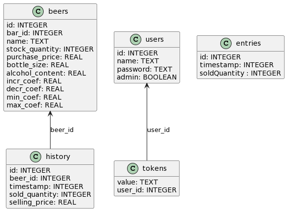

# Boursière

## Getting started

Run the tests.

```sh
go test
```

Start the server in development mode.

```sh
go run .
```

You can now access the server using the [web client](https://github.com/e-kot-unamur/boursiere-client).

The server uses an SQLite database. By default, it will be saved in a "db.sqlite3" file. You can override this file's name by setting the `DATABASE_FILE` environment variable.

There's also a `PORT` variable that defines the port to which the server listens to. It will be `8080` by default.

At startup, if no users exist in the database, a default administrator is created with username `admin` and password `boursière`. The password can (**and should**) be changed thereafter.

There is a [French user guide](./doc/guide.md) available. Take a look at it for more information.

## Routes

See the [detailed route description](./doc/routes.md) for more information.

| Method | Path              | Description                                                                                                      |
|-------:|:------------------|:-----------------------------------------------------------------------------------------------------------------|
|    GET | /api/beers        | Get the current status of all beers.                                                                             |
|   POST | /api/beers        | Delete all existing beers and upload new ones. **Authentication** as admin is required.                          |
|    GET | /api/beers/events | SSE route to get notified of price and quantity updates.                                                         |
|   POST | /api/beers/order  | Add (or remove) an amount to beers' sold quantities. **Authentication** is required.                             |
|    GET | /api/beers/stats  | Get current statistics about the event (only estimated profit for now). **Authentication** as admin is required. |
|    GET | /api/users        | Get the list of all existing users. **Authentication** as admin is required.                                     |
|   POST | /api/users        | Create a new user. **Authentication** as admin is required.                                                      |
|  PATCH | /api/users/:id    | Update a user. **Authentication** is required.                                                                   |
| DELETE | /api/users/:id    | Delete a user. **Authentication** as admin is required.                                                          |
|   POST | /api/users/token  | Generate a new access token in exchange for name/password authentication.                                        |
| DELETE | /api/users/token  | Delete a given access token, effectively logging out.                                                            |
|    GET | /api/entries      | Get the list of all entries. **Authentication** as admin is required.                                            |
|   POST | /api/entries      | Add (or remove) an amount to entries' sold quantities. **Authentication** is required.                           |

## Database



The `beers` table contains all static information about a beer type. On the other hand, `history` contains dynamic information such as the current price and quantity. For instance, a beer current selling price can simply be found by looking at its most recent history entry.

The `users` and `tokens` tables are used to authenticate accesses to the API.
